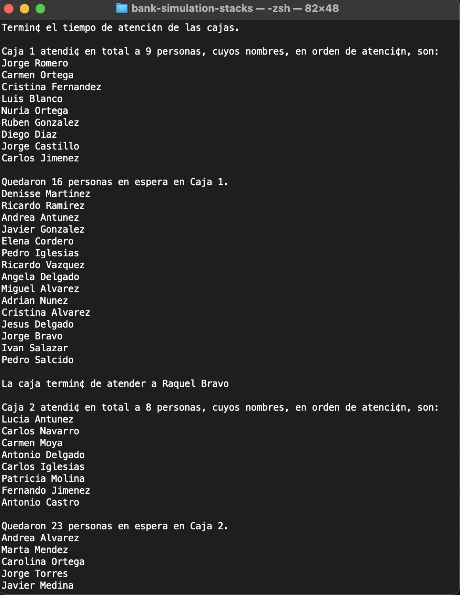
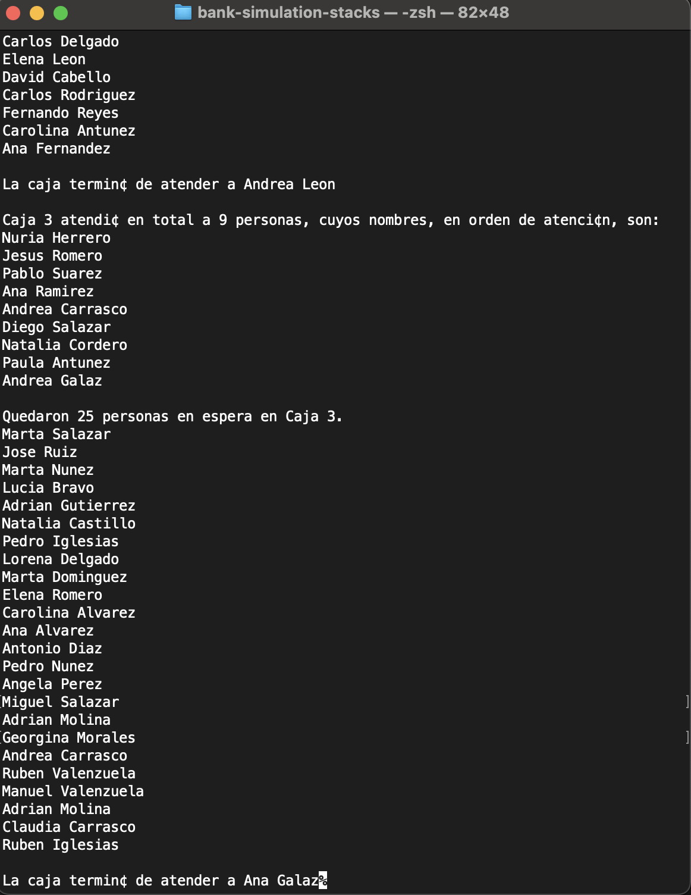

# Bank Simulation with Stacks and Queues

This is an academic project simulating a simple banking system where customers are attended in three different teller lines ("cajas"). The simulation uses a generic queue implementation in C++ to manage clients and their waiting times.






## Description

The simulation models the flow of clients arriving at a bank and being served by three tellers. Each teller has its own queue. Names are randomly generated from predefined lists of first names and surnames. The simulation is time-based and stops after a fixed interval.

The key features include:

- Generic queue data structure implementation (`Cola<T>`)
- Simulation of random customer arrivals and service durations
- Management of served and waiting customers per teller
- Console-based interaction and output

## Learning Objectives

- Practice object-oriented programming in C++
- Implement and use template-based data structures
- Understand queue dynamics in real-world simulations
- Gain experience with modular and documented code

## Project Structure

```
bank-simulation-stacks/
├── Caja.hpp            # Teller logic
├── Cola/              
│   ├── Cola.hpp        # Queue class interface (template)
│   └── Cola.tpp        # Queue class implementation
├── main.cpp            # Entry point and simulation logic
├── nombres.txt         # First names list
├── apellidos.txt       # Surnames list
├── docs/               # Doxygen-generated documentation
└── README.md           # This file
```

## How to Compile and Run

Make sure you are using a C++17-compatible compiler (like `g++` or `clang++`):

```bash
clang++ -std=c++17 -Wall -o bank-sim main.cpp
./test
```

> Do **not** compile `Cola.tpp` separately. It is included via `Cola.hpp`.

For Wondows:
You can run the executable `Cola.exe`.

## Requirements

- C++17 or higher
- Unix-based terminal for `clear` and `sleep` commands
- Basic knowledge of queues and C++ templates

## Screenshots

*(To be added manually with images from the simulation output)*

## Authors

- Ana Laura Chenoweth Galaz
- Georgina Salcido Valenzuela

## License

This project is provided for academic purposes and is licensed under the MIT License.

